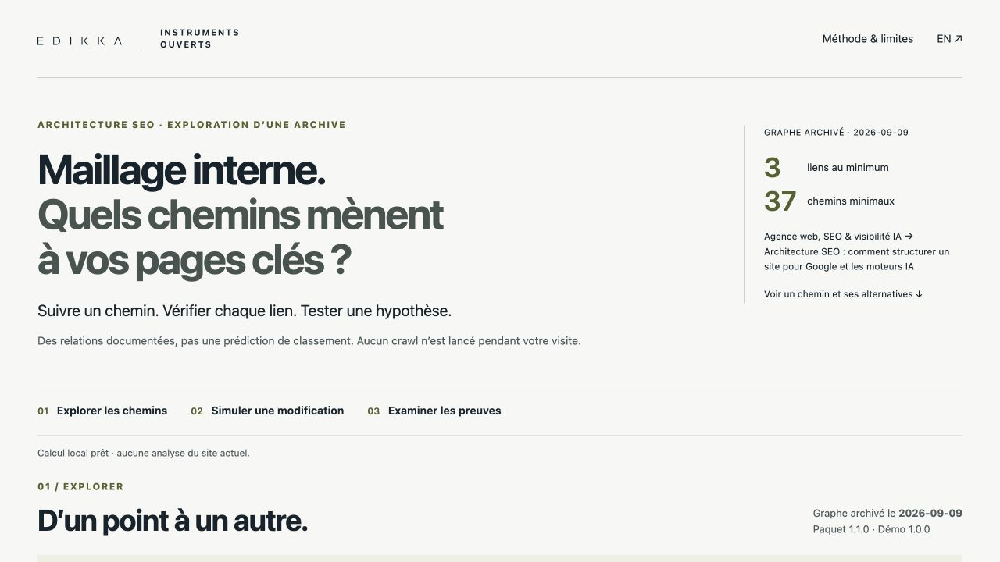

# Maillage interne : quels chemins mènent à vos pages clés ?

Démonstration Edikka **1.0.0**, interface français / anglais. Calcul local dans un graphe archivé, simulation réversible et preuves consultables.

**[Explorer la démonstration](https://edikkaweb.github.io/seo-architecture-demo/)** · **[English interface](https://edikkaweb.github.io/seo-architecture-demo/index-en.html)**

- [Matrice Architecture SEO dans la bibliothèque](https://www.edikka.com/bibliotheque#instrument-architecture-seo-decision-matrix)
- [Guide source FR](https://www.edikka.com/insights/seo/architecture-seo-site) · [Source guide EN](https://www.edikka.com/en/insights/seo/seo-architecture-website)
- [Reproduire le calcul / Reproduce the calculation](docs/REPRODUCTION.md)
- [Vérifications et limites](docs/TESTING.md)



## Ce qui est calculé

Le paquet source Edikka **1.1.0**, [publié ici](https://www.edikka.com/docbd/data/architecture-seo-decision-matrix-v1.1/manifest.json), décrit l’archive du **9 septembre 2026**. Import vérifié le 1 octobre 2026 : 11 tailles et SHA-256 conformes. Originaux CC BY 4.0, jamais réécrits. La date d’exécution n’est pas une nouvelle observation du site.

Les nombres sont recalculés : 188 sources avec adjacency, 430 URL distinctes, dont 242 destinations aux liens sortants non documentés. Il ne s’agit pas de 430 pages intégralement auditées. 6 729 relations dirigées uniques, dont 188 liens vers soi-même.

La recherche en largeur retrouve **3 liens / 37 chemins** pour le guide FR et **3 liens / 2 chemins** pour le guide EN, depuis `https://www.edikka.com/`. Elle compte exactement avec BigInt, puis énumère au plus 50 chemins, dans l’ordre lexicographique des URL. Un chemin est une suite d’URL reliées dans le graphe, pas un parcours de visite mesuré.

## Simulation

Huit opérations au maximum, entre URL connues, depuis une source documentée. Ajouts et retraits portent sur des couples orientés dédupliqués. Retirer un couple ne simule pas nécessairement le retrait d’une occurrence HTML. Les exemples guidés sont des hypothèses :

- ajout accueil → guide FR : 1 lien, 1 chemin minimal ;
- retrait FAQ SEO → guide FR : toujours 3 liens, mais 34 chemins minimaux.

Les versions, URL et opérations sont conservées dans un lien partageable et un export JSON. Le changement de langue préserve le scénario. Les paramètres invalides sont refusés avec une explication et un retour à l’exemple initial. Aucun traceur ni backend d’analyse.

## Développement

Node.js 22 ou ultérieur, aucune dépendance npm.

```sh
npm run build
npm test
npm run serve
# http://127.0.0.1:4185/seo-architecture-demo/
```

`originals/` : octets publics inchangés. `data/` : provenance de l’import et dérivé d’affichage. `src/engine.mjs` : moteur pur commun. `src/render.mjs`, `app.mjs`, `style.css` : interface. `src/derive.mjs` : intégrité et dérivation. `tests/` : tests de corpus et graphes synthétiques distincts. `dist/` : publication statique reconstruite par le workflow Pages.

## Portée / Scope

Ce graphe est postérieur à l’intervention du 15 août. La correction éditoriale du 21 septembre est une preuve distincte, non intégrée dans ce graphe historique. Les extraits `pages.csv` et `links.csv` ne remplacent pas `graph.json` pour le calcul. Les ancres et les zones de page sont inconnues ; les H1 observés se limitent à l’extrait disponible. Les autres libellés dérivent des URL.

No SEO score, ranking, traffic, indexation or visitor behaviour is inferred. Unreachable does not mean orphan; undocumented outgoing links do not mean no links. A shorter path is not an editorial recommendation. The English interface preserves the same archive and endpoints. Static reference examples and reproduction instructions remain available without JavaScript.

## Licences

Nouveau code : [MIT](LICENSE), copyright Edikka 2026. Données originales : [CC BY 4.0](originals/license.txt), attribution **Edikka — SEO Architecture Decision Matrix, version 1.1.0**, source et date d’accès dans `data/import-provenance.json`. Les données dérivées conservent cette attribution et la licence CC BY 4.0. Les marques ne sont pas concédées par ces licences.

[Contribuer / Contributing](CONTRIBUTING.md) · [Toutes les démonstrations / All experiments](https://edikkaweb.github.io/)

La détection automatique de GitHub peut afficher « Other » : le fichier LICENSE conserve les exclusions des archives, composants tiers et marques. Le code original reste sous MIT dans le périmètre indiqué. / GitHub may show “Other”; the existing licence scopes and exclusions remain authoritative.
